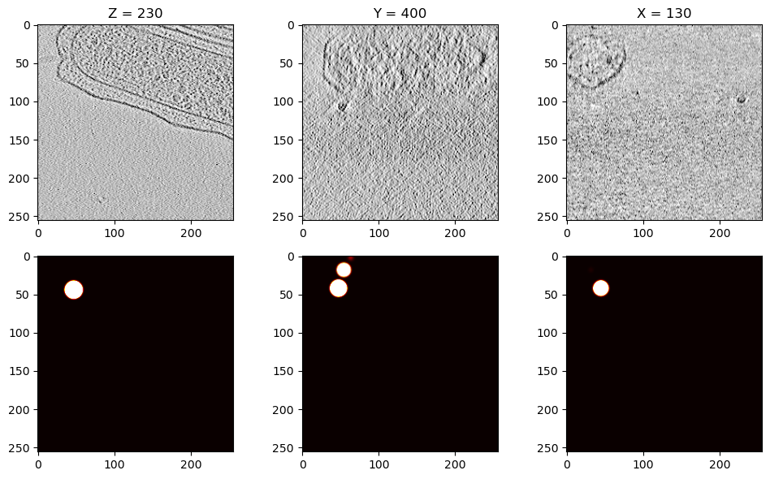

# Abstract
- 3D-Unet Implementation

# Have done
## 3D-Unetの実装
実装することはできた。そのため次は学習とHyperparameter Tuning

加えて、推論の際のアルゴリズムを作成することが必要になる。$256\times256\times256$だとメモリ容量が足りるのかが心配なものの、どうせKaggle Notebookならそこまで変わらないのではないかとも思う。
無理そうならGoogle Colabで学習させてその後にKaggle Notebookで実装する流れで
- Gaussian BallでのLabelingに成功
    - やったああああああああああ！！！！！とても嬉しい😄
    - 問題はこれが本当に効果があるのかということ。
        - 実装経験として書くことができるため理想的ではある。Saiko!!!!!
    - X,Y方向での

# What I learn
- pytorch.TensorDatasetはTensorを分割して読み込むためのもの
    - そのため256*256*256のテンソルを与えると256枚の256*256テンソルとして捉えられてしまう。そのためunsqueezeで次元を一つ増やすことが必要になる
# Problem
- 意外とX,Y方向での画像がノイズだらけ・・・

- これをDenoizeしてもいいが、そればかりやるとノイズに強いモデルを作ることができなくなる。それはスコアに大きな影響を与えてしまうので問題・・・
- Labelingの際の球が少し大きすぎる。
    - 2乗することで解決できるのではないかと期待。
    - これでより細いピークになるはず。できるなら標準偏差とか小さくしたいが、3次元のためそれは難しい。共分散行列をうまくコントロールすればいいのだろうが、今はその時間がないため割愛。

- Scanningはこのコンペでやっている人がいない？
    - 理由はわからないがそんな気がする。Discussionで聞いてみるのはひとつかもしれない。
        - 評価対象として入っているのかもしれない。もしかするとこれがあるとかなり評価が下がる恐れも。それなら全てをスキャンしながらのほうがいいのか？
        - よくわからない。
# Idea

# Next